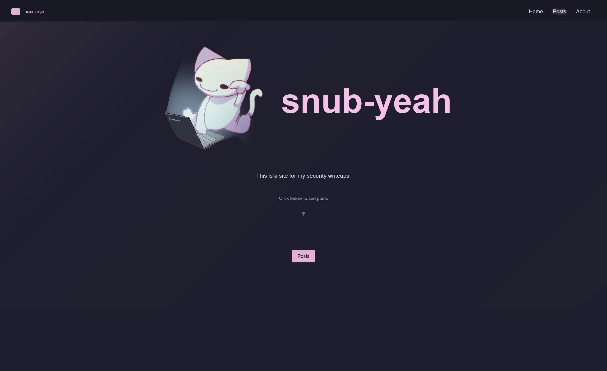
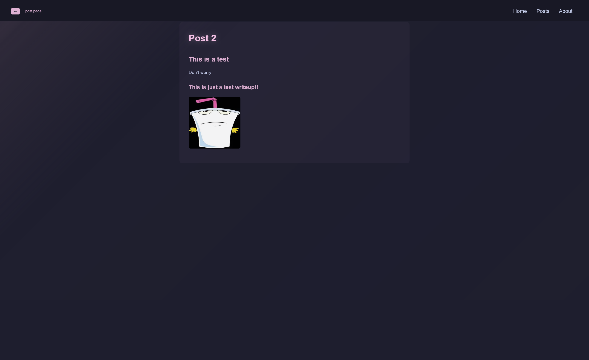

# Snub-yeah Security Site
## [Live Deployed Site](https://snub.lol/)
This is a personal site where I (will hopefully in the future) have my cybersecurity writeups and posts. It also features a cat.

## Features
- Clean layout across the site
- Dynamically updated security posts
- Animations for most of the site
- A cat

### Demo 
*Click either of the screenshots below to see a demonstration video*

[ ](https://youtu.be/5Tg4KPVfp7U?si=72HKI7EbsSGwg0eq)

[ ](https://youtu.be/5Tg4KPVfp7U?si=72HKI7EbsSGwg0eq)

### Installation
Clone the repository with
```
https://github.com/snub-yeah/Security-Site.git
```
Change into folder
```
cd Security-Site
```
Install dependencies
```
npm install
```
Start the developmental server
```
npm run dev
```

#### Future Changes
- More cats
- Real posts
- Better about page and navigation (more contact methods)
- ~~Sorting post options~~ (kinda)
- ~~Implementation of JSDeliver to speedup load times~~
- Mobile Layout

#### Technologies
- Next with TypeScript
- Tailwind CSS
- Anime.js for animations

#### What I learned
I learned Anime.JS with this project. I had never used it, and it is cool. I also learned a bit of typescript for this project. This project also increased by knowledge of Next. 
